[**查看《色彩与构图》PDF原文**](https://www.kdocs.cn/l/ctid8z8HOYUz)

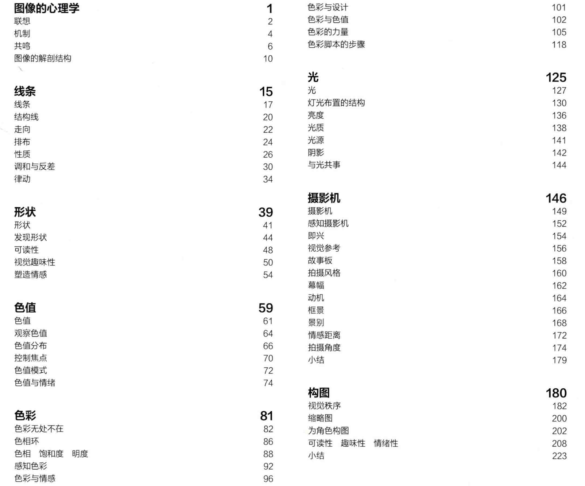

# 一、图像心理学

联想：元素，情感。意象

机制：画面中的潜在动态。形状、线条、色彩之间的配合、冲突、对比等。

共鸣：你要说什么与你是怎么说的保持一致所发生的情形。将信息的性质和内容与传递信息的视觉元素联系起来，就可以大幅提高有效性（红色的警告标志，黑黄的化学品标志）。两件事：利用设计元素流畅的"说话"；为特定的镜头确立契合的情绪。

图像的解剖结构：

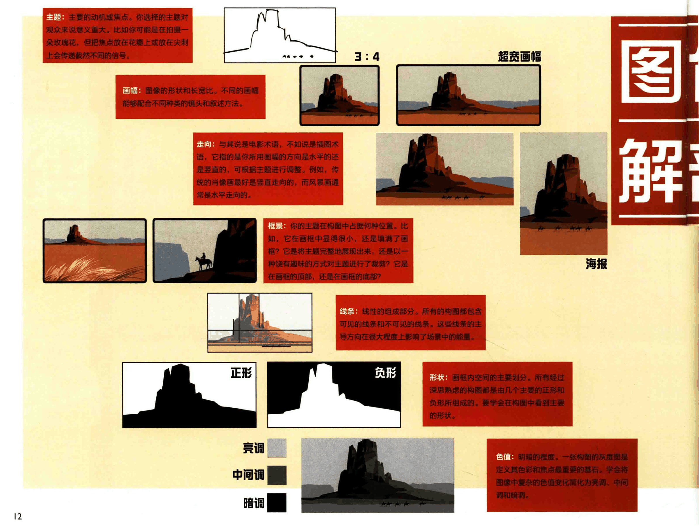

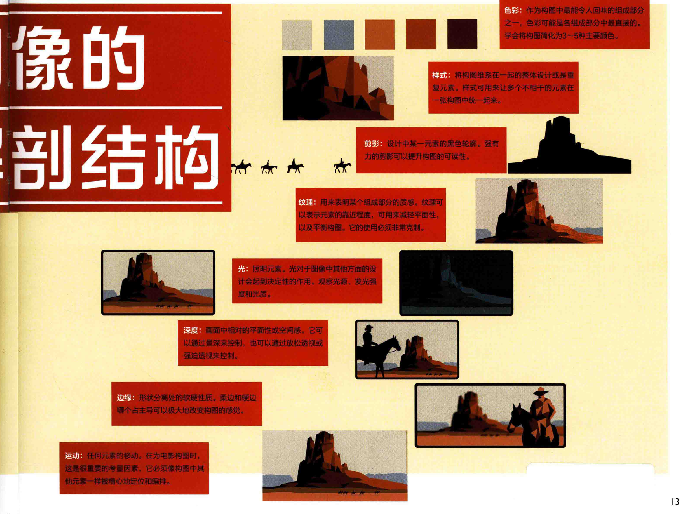

# 二、线条

## 1. 结构线：构图的核心骨架

我们可以通过分析一个画面的主要方向、分界处和运动轨迹，将复杂的景物归结为本质的视觉元素。不同的结构线可以唤起不同的情绪。

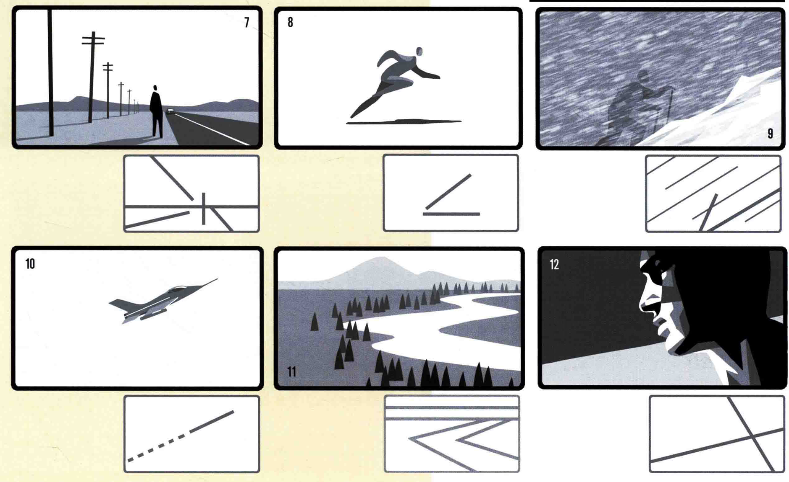

## 2. 走向

走向是指线条相对于画框边缘的排布方式。走向会影响情感。

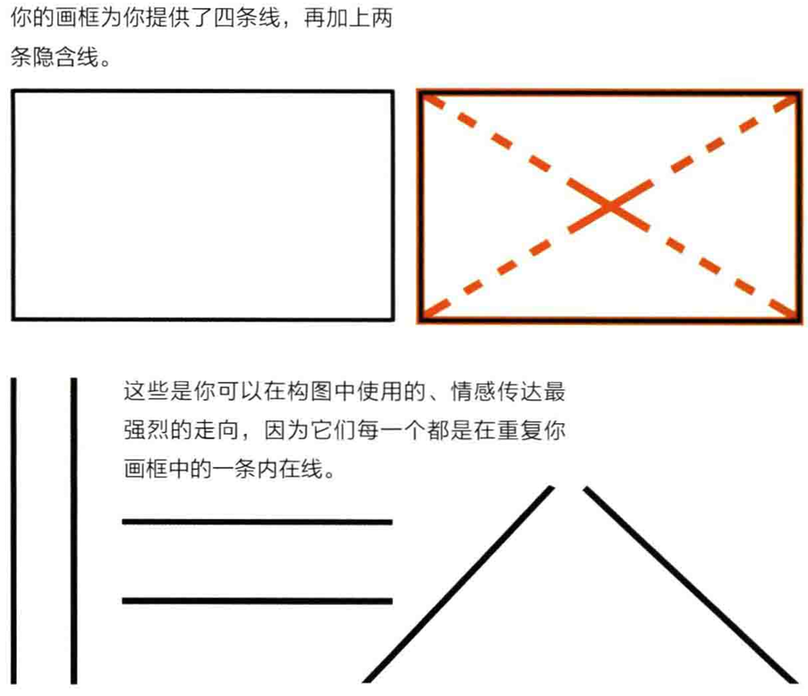

## 3. 排布

排布是指用线条对画框中空间的划分。

对称划分：平衡、静态。

平衡的非对称划分：三等分和黄金分割等

不平衡的非对称划分会让人感到不适。

## 4. 性质

线条的性质是唤起人们情绪的主要成分之一

曲直，粗细，水润干枯，波浪锯齿等等

| | |
|---|---|
| 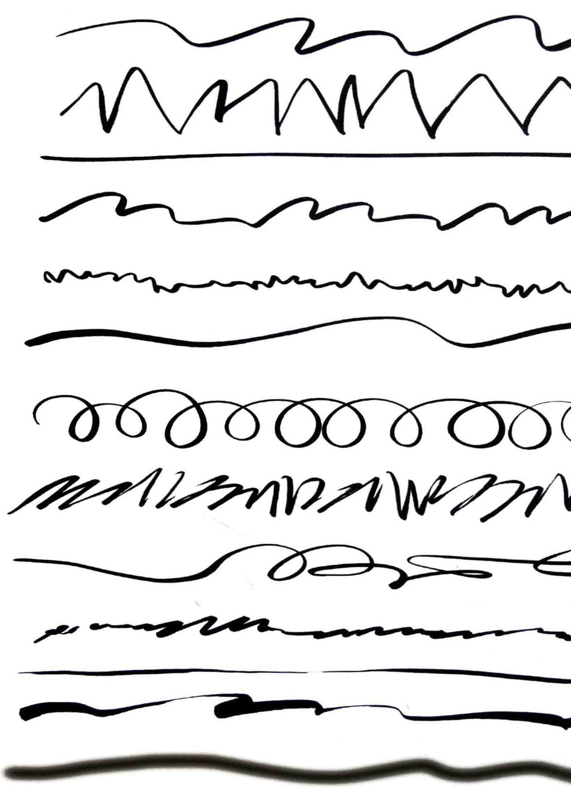 | 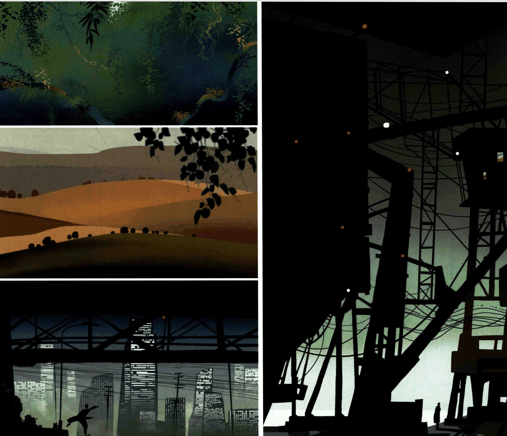 |
| 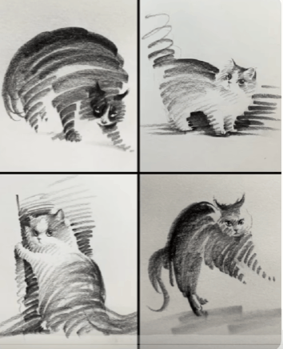 | 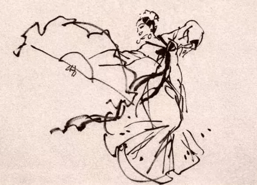 |

## 5. 调和与反差

画面中线条之间不同的关系，可以创造出律动感、调和感、不调和感、平衡感、不平衡感、统一感。

画布天生就有四条边框线，所以增加的每一条都会影响整体。

调和：走向和性质比较相似的线条，比如海平面，地平线的画面

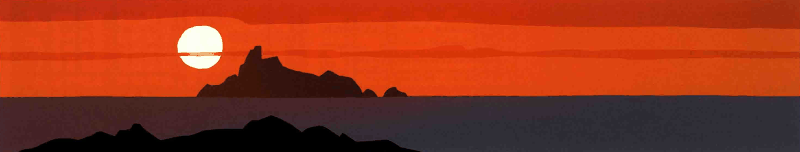

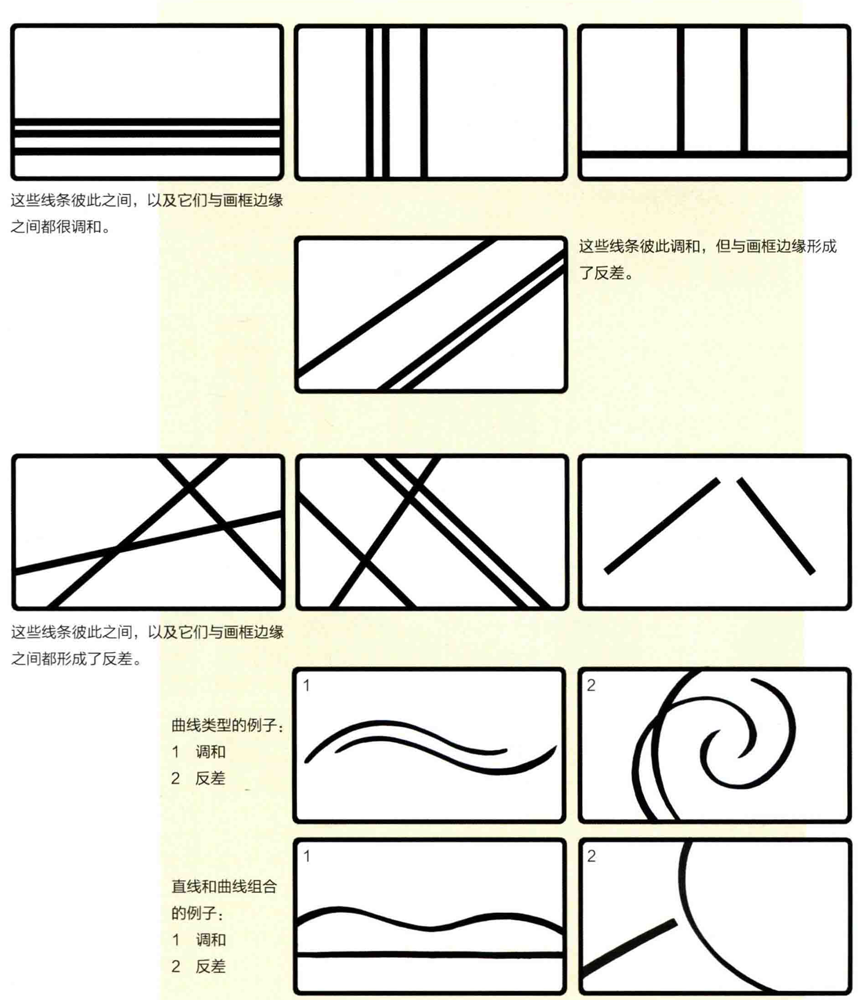

## 6. 律动

让相似的线条以某种律动式的间隔重复，不均匀的或随机的间隔会给画面增加更多的刺激感，甚至增加紧张感（如破碎的镜子），反之固定重复的线条或者以某种特定比例分布的线条，会让画面看起来有条不紊或是枯燥无味。

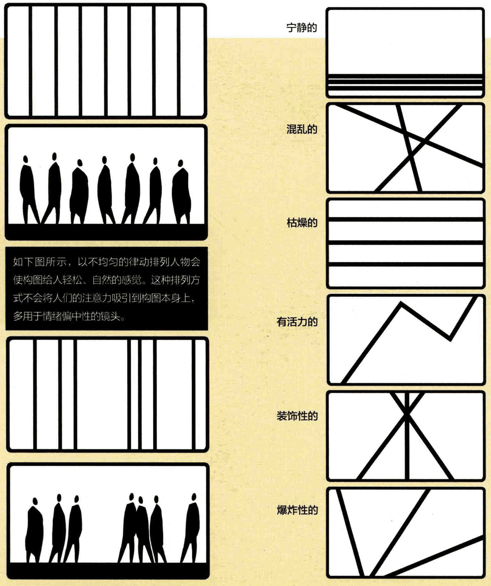

# 三、形状

形状指的是图像中由物体、色调或颜色抽象化的封闭区域。在电影构图中，这一元素对镜头的可读性和情感冲击起核心作用。学会控制形状，就能让同一座山带给人不同的感觉，它可以是尖锐、危险的，也可以是平坦、乏味的，还可以是俏皮、诱人的。

## 1. 发现形状

构图是由正形和负形组成的。正形由图像中较暗的色调和色彩构成，而负形则是由色调较浅的区域或是留白构成。它们相互作用，可展现画面的成功或失败，而如何绘制出优秀形状的那些规则对于正负形来说都是通用的。

| | |
|---|---|
| 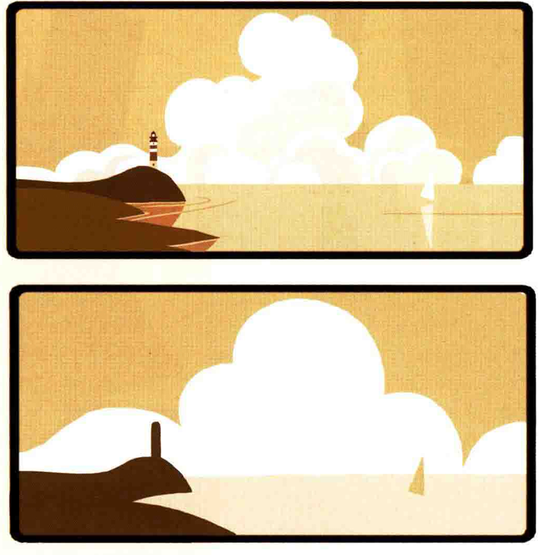 | 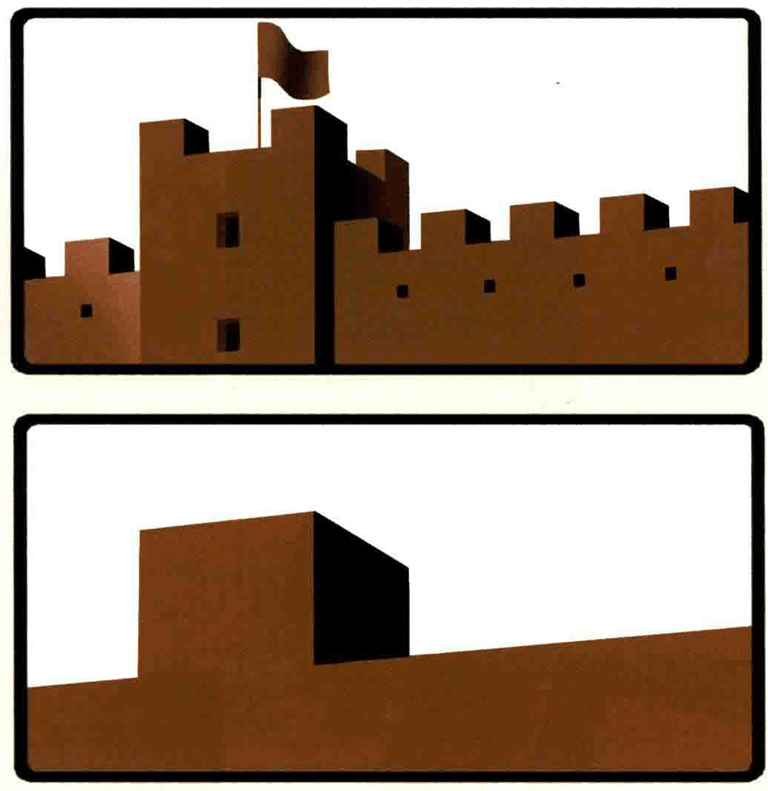 |

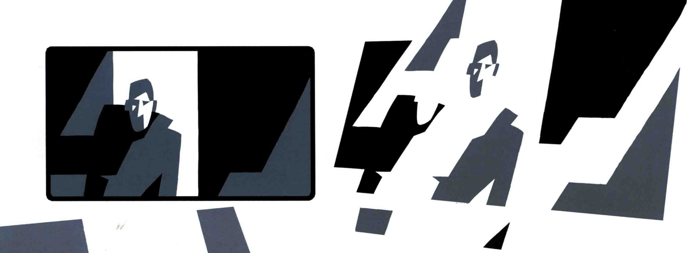

这些提炼出来的构图展示了一些可以用来设计图像中结构性形状的不同手段。负空间、光影、前景物体、人物的排列，以及镜头的视角，这里仅列举这几种方式，它们都能够让镜头打破空间从而创造出有趣的构图动态。

在心里建立起这种基于形状的过滤器，通过它来观察事物，这将有助于注意力集中到画面的图形分解上。这个阶段注意形状之间的相互作用，而不是他们各自代表什么。

## 2. 可读性

一个优秀的形状设计应该是清晰可读的。对于世界上所有的艺术作品来说，如果观众看到最后不知道在看什么，那么再好的艺术诠释都会有些难以自圆其说。影视作品一个镜头只有几秒钟的时间来传达表达内容，因此设计可以被观众快速读懂的形状是至关重要的。

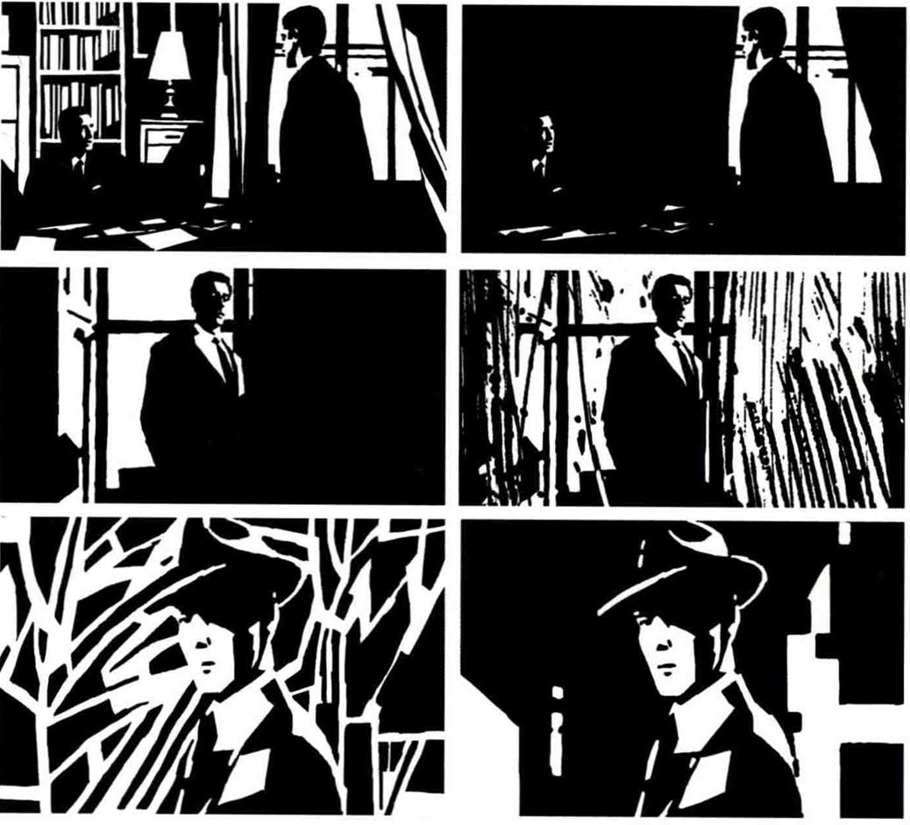

### 游戏动画设计中的可读性设计

1. 流程清晰：要确保每个动作每个pose的轮廓可读性，只有剪影也能知道动画内容，让玩家都能知道这一阶段需要做什么。

   - 前摇预备：给玩家一个预判动作的时间，如黑魂中Boss的动作流程：刀举很高，身体完全打开，停顿，攻击。轮廓极其清晰。
   - 攻击
   - 收招后摇：失衡，落地，硬直等，告诉玩家可以攻击。

2. 节奏可读性：在连击中攻击和停顿形成节奏，类似音乐节奏型。

3. 视觉焦点控制：必须控制玩家看哪里。
   - 最大运动量原则：眼睛天然追踪位移更大速度更快的物体，所以在制作中必须要控制各部分的幅度，保证最重要的内容是最显眼的。
   - 特效聚集：特效发光或者建立引导线把观众的注意力吸引过去。

关于力传递：力传递就是一种增加可读性的设计

## 3. 视觉趣味性

如果单个形状的边界具有多样性，图像中的各形状之间存在差异，那么这样的构图比起没有这些特征的构图在视觉上更能令人兴奋。轮廓的变化、大小的差异，以及在画面中不同的分布位置，这些都会提升镜头的视觉戏剧性。这种多样性会使图像更具活力，能够更好地持续吸引观众的注意力。

然而为了使这种多样性具有吸引力，这种多样性必须是有节制的。如果是狂乱无序、互不关联的形状，即使具有丰富的多样性并能带来视觉刺激，但这并不是想要的效果。在构图中纳入任何反差时，必须考虑它与调和性、可读性等因素之间的平衡。这需要一点一点地练习，你会逐渐了解在什么样的情况下，多少变化是"太多了"，多少变化又是"太少了"。只要能坚持下去，它终将成为你的第二本能。

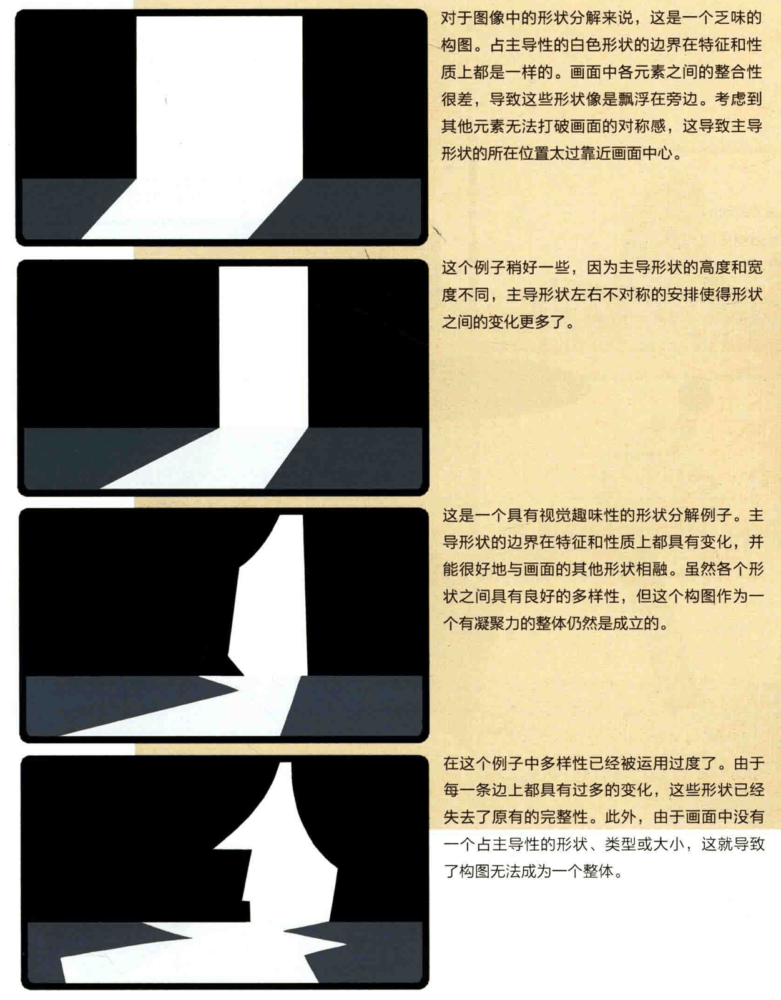

视觉趣味性 = 预期与变化 = 秩序与打破 = 统一与差异

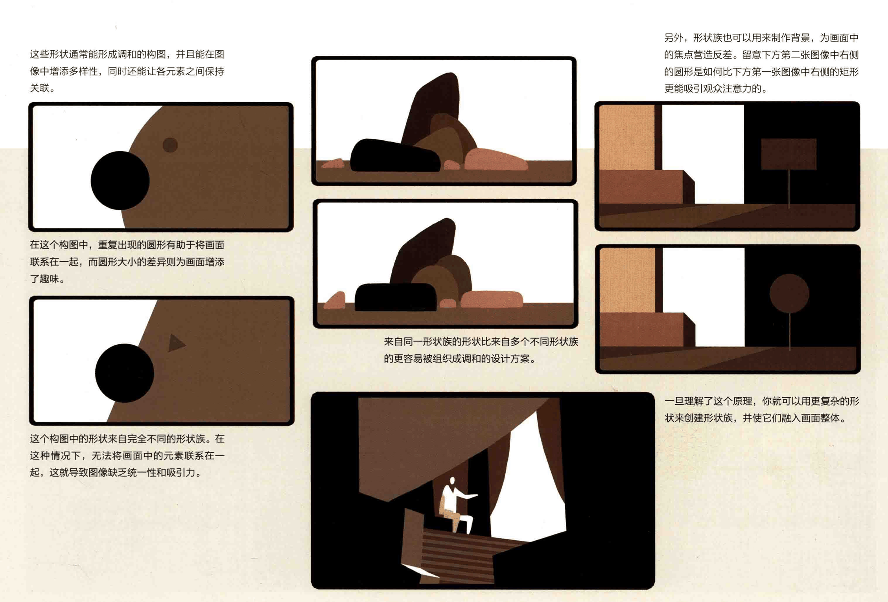

### 游戏动画中的视觉趣味性

形状设计（Shape Design）→ 姿态设计（Pose Design）→ 节奏设计（Timing）

形状变化：大动作 + 小动作（主动作——次级动作），长线条 + 短线条，直线 + 曲线（身体弧线，运动弧线）

节奏变化：快慢，节奏型

重心变化：平衡——失衡

**核心：避免均匀，创造差异，但不要乱**

## 4. 情感准确性

图像中形状的类型和大小关系对构图的氛围有着巨大的影响。某些类型的形状和大小的反差会产生视觉上的紧张感，而另一些则会减弱这种紧张感。在设计构图时考虑到这一点——形状会与镜头的内在结构交织在一起，就可以凭借这一点在视觉上强化某个桥段。

抽象画经常会通过形状塑造出一些动态来营造某种情感反应，即使这些形状不代表任何具体的东西。同样的动态也可以用来加强那些需要处理实际场景与角色的构图。例如，画面中角色周围的负空间是由破碎、参差不齐的三角形所组成，而不是由长方形或曲边形状所组成，这样的构图给人的感觉会更具威胁性。这可以通过布景设计或者在画面中仔细摆放实际存在的道具来创造。这一效果的基础原理就是前面讨论过的图像心理学中联想这一概念。一般来说，尖锐的形状比圆润的形状更能带给人危险的感觉，因为我们往往会把尖锐与威胁联系起来。

除了每个元素各自的性质，不同形状之间的调和与反差也会改变图像带给人的感觉。一般来说，由同一形状族所组成的构图，如城市景观的天际线中重复出现的矩形会使得图像更加调和。如果构图是基于美感、装饰感、宁静感或者某种富有规律的图案设计，那么调和的形状对于这种构图来说是非常有效的。只要相似性中仍存在着些许变化，这些便可以形成非常有趣的视觉效果。

另一方面，反差式的形状和大小能够增加构图的视觉张力。极端的大小差异会增加画面中的视觉能量，创造出强烈的戏剧感。一个人站在一根恢弘大气的柱子旁的镜头与一个人站在一根细小优雅的柱子旁的镜头，会令观众产生截然不同的视觉反应。

研究艺术品、建筑物与自然景观，分析你所看到的潜在形状是如何影响情绪的。对这种感觉的影响最大的是形状的类型、大小关系，还是画面中的调和与反差？提高这方面的敏感度，能够充实你的资料库，使你意识到那些你从未考虑过的形状的情感应用。一旦你掌握了这个基本概念，就可以用这个概念发掘各种联想。

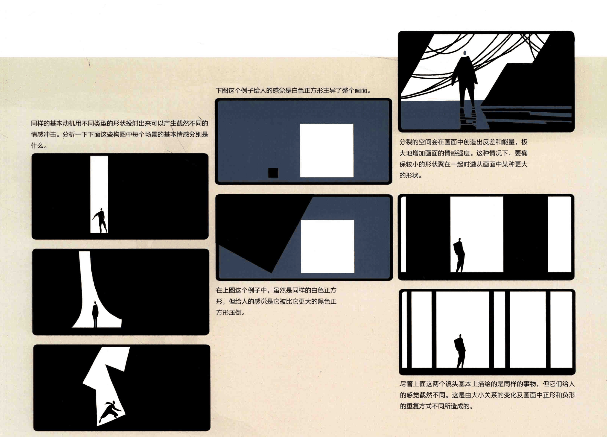

# 四、色值

# 五、色彩

# 六、光

# 八、构图

## 可读性，趣味性，情绪性

**可读性**：控制焦点，控制信息量

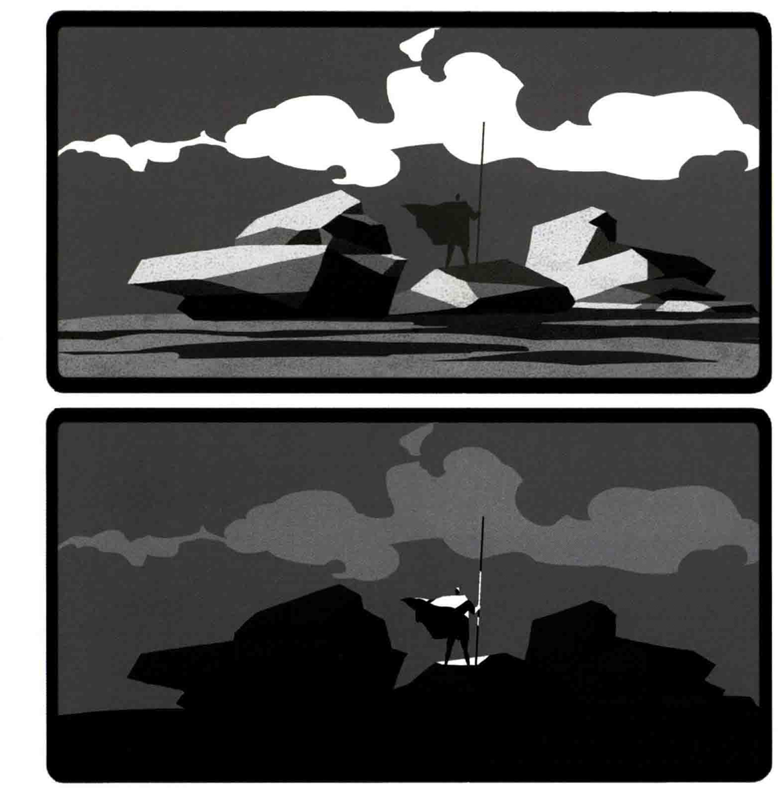

**趣味性**：一个明确的焦点、调和与反差之间的合理平衡、少数关键设计元素明确的主导地位，以及质地和律动的有趣变化。

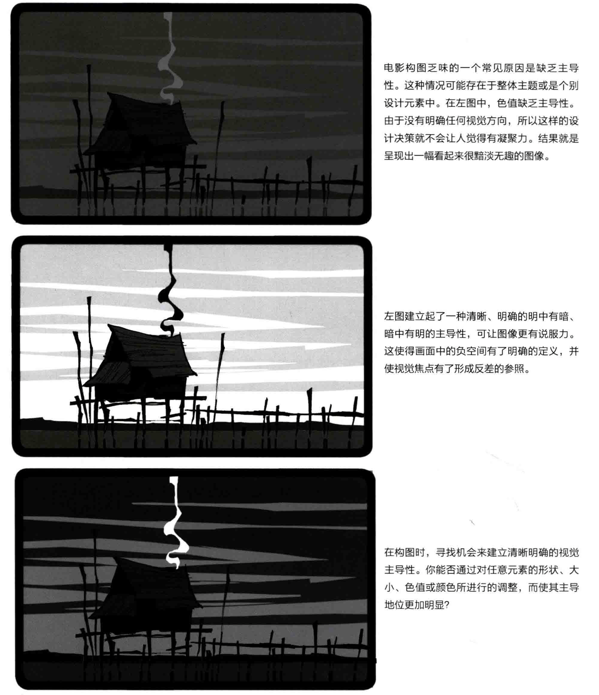

**情绪性**：元素的选择是否是为了情绪服务

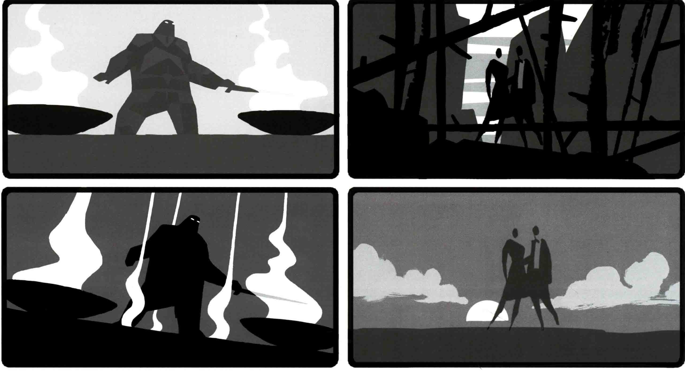

形状，构图，打光，场景元素 —— 信息量的控制，使观众注意力集中
